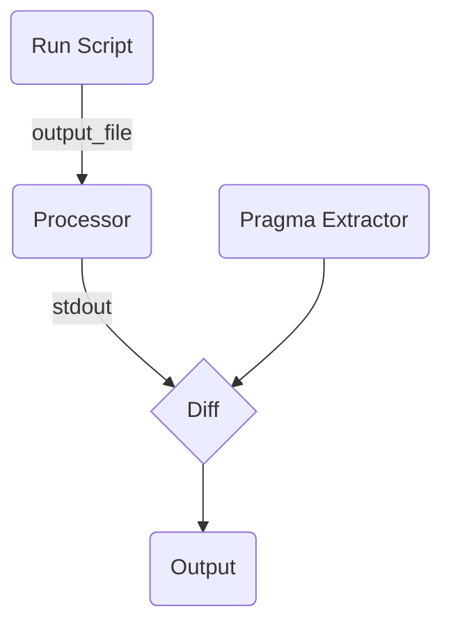
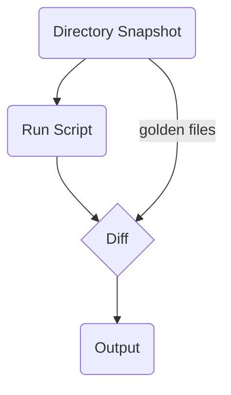

# Design

In this document, we will explore the design behind SCATR on a high level.

## Concepts

### Run scripts

To make SCATR as flexible as possible, it allows custom scripts and the corresponding interpreter as a part of its test pipeline.

Take the following scenario as an example,

A user wants to test a Python static analysis tool, but the tool has no command-line entrypoint. In this case, the user can specify `python` as the script interpreter and provide a Python script directly inside `.scatr.toml`.

Another case where this may be useful is when a user wants to test a tool that
provides the output on `stdout`. In this case, the user may use a shell script
that pipes the `stdout` to a file.

### Processors

No universal standard exists for static analysis tools to output their results. Processors are programs that convert the analysis tool output to something SCATR accepts. Processors can be considered a plugin system allowing SCATR to ingest virtually any input format.

### Issue Pragmas

Being a test runner, SCATR needs a list of "expected" issues. Rather than inventing a new format just for this, SCATR allows users to put expected issues as comments.

Current issue pragma syntax allows multiple instances of multiple issues on the same line. The format is documented in [README.md](./README.md).

### Golden files

To test Autofix, SCATR requires the "expected" result. Specifying this in comments and issue pragmas is very convoluted, so SCATR has a concept of "golden files," which are files that contain the expected output after the Autofix tool has been run. The Autofix tool is expected to modify the source file in place. SCATR then calculates a diff and restores the original file.

## Testing pipeline

### Checks

The testing pipeline of checks consists of two stages,

1. The `run` stage. This is when the check run script is run.
2. The `processor` stage. In this stage, the output of the `run` stage is processed to make it compatible with SCATR.

After processing, SCATR reads the issue pragmas and then calculates discrepancies between the pragmas (expected) and the actual tool result.

### Autofix

As the Autofix runner is expected to modify the input file in place, testing Autofix doesn't require any processing. SCATR runs the script for the Autofix test and calculates a diff between the Autofix'ed file and the golden file.

Internally, it also creates a snapshot of the current test directory state using the `files` glob pattern and the root `.gitignore`. This snapshot is then restored after the diff has been calculated.

